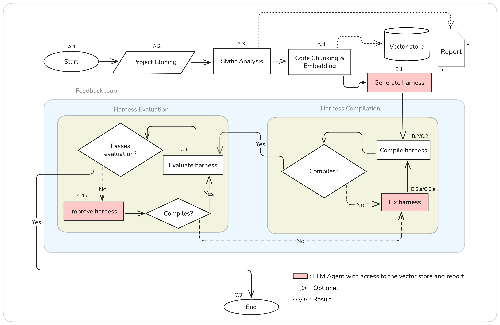
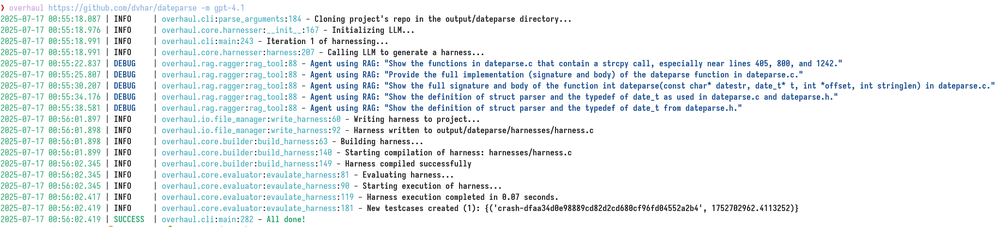

# OverHAuL

In this thesis we present *OverHAuL* (**H**arness **Au**tomation with **L**LMs), a neurosymbolic AI tool that automatically generates fuzzing harnesses for C libraries through LLM agents. In its core, OverHAuL is comprised by three LLM ReAct agents [@reAct]---each with its own responsibility and scope---and a vector store index reserving the given project's analyzed codebase. An overview of OverHAuL's process is presented in @fig-flowchart. The objective of OverHAuL is to streamline the process of fuzz testing for C libraries. Given a link to a git repository [@torvalds2005] of a C library, OverHAuL automatically generates a new fuzzing harness specifically designed for the project. In addition to the harness, it produces a compilation script to facilitate building the harness, generates a representative input that can trigger crashes, and logs the output from the executed harness.

:::{#fig-flowchart}


Overview of OverHAuL's automatic harnessing process.
:::

As commented in @sec-differences, OverHAuL does not expect and depend on the existence of client code or unit tests [@utopia; @fudge; @fuzzgen] *nor* does it require any preexisting fuzzing harnesses [@oss-fuzz-gen] or any documentation present [@sun2024]. Also importantly, OverHAuL is decoupled from other fuzzing projects, thus lowering the barrier to entry for new projects [@oss-fuzz-gen; @oss-fuzz]. Lastly, the user isn't mandated to specify manually the function which the harness-to-be-generated must fuzz. Instead, OverHAuL's agents examine and assess the provided codebase, choosing after evaluation the most optimal targeted function.

OverHAuL utilizes autonomous ReAct agents [@reAct] which inspect and analyze the project's source code. The latter is stored and interacted with as a set of text embeddings [@mikolov2013], kept in a vector store. Both approaches are, to the best of our knowledge, novel in the field of automatic fuzzing harnesses generation. OverHAuL also implements an evaluation component that assesses in real-time all generated harnesses, making the results tenable, reproducible and well-founded. Ideally, this methodology provides a comprehensive and systematic framework for identifying previously unknown software vulnerabilities in projects that have not yet been fuzz tested.

Finally, OverHAuL excels in its user-friendliness, as it constitutes a simple and easily-installable Python package with minimal external dependencies---only real dependency being Clang, a prevalent compiler available across all primary operating systems. This contrasts most other comparable systems, which are typically characterized by their limited documentation, lack of extensive testing, and a focus primarily on experimental functionality.^[I.e. "research code".]

## Architecture

OverHAuL can be compartmentalized in three stages: First, the project analysis stage (@sec-analysis), the harness creation stage (@sec-creation) and the harness evaluation stage (@sec-evaluation).

### Project Analysis {#sec-analysis}

In the project analysis stage (steps A.1--A.4), the project to be fuzzed is ran through a static analysis tool and is sliced into function-level chunks, which are stored in a vector store. The results of this stage are a static analysis report and a vector store containing embeddings of function-level code chunks, both of which are later available to the LLM agents.

The static analysis tool Flawfinder [@flawfinder] is executed with the project directory as input and is responsible for the static analysis report. This report is considered a meaningful resource, since it provides the LLM agent with some starting points to explore, regarding the occurrences of potentially vulnerable functions and/or unsafe code practices.


The vector store is created in the following manner: The codebase is first chunked in function-level pieces by traversing the code's Abstract Syntax Tree (AST) through Clang. Each chunk is represented by an object with the function's signature, the corresponding filepath and the function's body. Afterwards, each function body is turned into a vector embedding through an embedding model. Each embedding is stored in the vector store. This structure is created and used for easier and more semantically meaningful code retrieval, and to also combat context window limitations present in the LLMs.

### Harness Creation{#sec-creation}

Second is the harness creation stage (steps B.1--B.2). In this part, a "generator" ReAct LLM agent is tasked with creating a fuzzing harness for the project. The agent has access to a querying tool that acts as an interface between it and the vector store. When the agent makes queries like "functions containing `strcpy()`", the querying tool turns the question into an embedding and through similarity search returns the top $k=3$ most similar results---in this case, functions of the project. With this approach, the agent is able to explore the codebase semantically and pinpoint potentially vulnerable usage patterns easily.

The harness generated by the agent is then compiled using Clang and linked with the AddressSanitizer, LeakSanitizer, and UndefinedBehaviorSanitizer. The compilation command used is generated programmatically, according to the rules described in @sec-assumptions. If the compilation fails for any reason, e.g. a missing header include, then the generated faulty harness and its compilation output are passed to a new "fixer" agent tasked with repairing any errors in the harness (step B.2.a). This results in a newly generated harness, presumably free from the previously shown flaws. This process is iterated until a compilable harness has been obtained. After success, a script is also exported in the project directory, containing the generated compilation command.

### Harness Evaluation {#sec-evaluation}

Third comes the evaluation stage (steps C.1--C.3). During this step, the compiled harness is executed and its results evaluated. Namely, a generated harness passes the evaluation phase if and only if:

1. The harness has no memory leaks during its execution
   This is inferred by the existence of `leak-<hash>` files.
2. A new testcase was created *or* the harness executed for at least `MIN_EXECUTION_TIME` (i.e. did not crash on its own)
   When a crash happens, and thus a testcase is created, it results in a `crash-<hash>` file.
3. The created testcase is not empty
   This is examined through xxd's output given the crash-file.

Similarly to the second stage's compilation phase (steps B.2--B.2.a), if a harness does not pass the evaluation for whatever reason it is sent to an "improver" agent. This agent is instructed to refine it based on its code and cause of failing the evaluation. This process is also iterative. If any of the improved harness versions fail to compile, the aforementioned "fixer" agent is utilized again (steps C.2--C.2.a). All produced crash files and the harness execution output are saved in the project's directory.

## Main techniques

- Feedback loop (improvement + verification)
  This iterative structure creates a feedback loop which terminates if an acceptable working harness has been achieved or the *iteration budget* has been depleted. This iteration budget is shared among the compilation and evaluation loops, i.e. it is decreased any time a dashed arrow in the flowchart is followed.
- Triplet of ReAct agents
    An important point to stress is that each agent is a separate LLM instance, albeit of the same model. This means that the agents have different and separate contexts during each run. This technique allows more exploration per run, since for example the "improver" agent can explore different search paths regarding the harness that the "generator" agent may have internally rejected. It also keeps context window limitations manageable, since the load is shared between the agents.

- Code exploration through vector store
  - Context window thoughts
  - Why RAG? Semantic chunking, most similar to paragraph-level chunking, most used technique. Codex was fine-tuned with functions as input [@chen2021]. The bigger the chunk, the bigger the noise [@zhao2024].
  
The algorithm corresponding to the flowchart in @fig-flowchart can be seen in @alg-main.

```pseudocode
#| label: alg-main
\begin{algorithm}
\caption{Test Harness Generation with Iterative Refinement}
\begin{algorithmic}
\Procedure{Main}{}
  \State $args \gets$ \Call{ParseArguments}{}
  \State $project\_path, model \gets args.project\_path, args.model$
  \State $analyzer \gets$ \Call{ProjectAnalyzer}{$project\_path$}
  \State $project\_info \gets analyzer.$\Call{CollectProjectInfo}{}
  \State \Call{LoadEnvironment}{}
  \State $embedder \gets$ \Call{CreateEmbedder}{$embedding\_model$}
  \State $chunks \gets$ \Call{ExtractChunks}{$project\_path$}
  \State $index, meta \gets$ \Call{EmbedChunks}{$chunks, embedder$}
  \State $rag\_tool \gets$ \Call{MakeRagTool}{$index, meta, embedder$}
  \State $harnesser \gets$ \Call{Harnesser}{$model, project\_path, rag\_tool$}
  \State $file\_manager \gets$ \Call{FileManager}{$project\_path$}
  \State $builder \gets$ \Call{HarnessBuilder}{$project\_path$}
  \State $evaluator \gets$ \Call{HarnessEvaluator}{$project\_path$}
  \State $acceptable \gets false$
  \For{$i = 1$ to $MAX\_ITERATIONS$}
    \State $harness \gets harnesser.$\Call{GenerateHarness}{$project\_info$}
    \State $file\_manager.$\Call{WriteHarness}{$harness$}
    \State $error, compiled \gets builder.$\Call{BuildHarness}{}
    \State $project\_info.compiles \gets compiled$
    \If{$\neg compiled$}
      \State $project\_info.error \gets error$
      \State \textbf{continue}
    \EndIf
    \State $output, accepted \gets evaluator.$\Call{EvaluateHarness}{}
    \If{$\neg accepted$}
      \State $project\_info.output \gets output$
      \State \textbf{continue}
    \Else
      \State $acceptable \gets true$
      \State \textbf{break}
    \EndIf
  \EndFor
  \State \Return $acceptable \land project\_info.compiles$
\EndProcedure
\end{algorithmic}
\end{algorithm}
```

## Examples

::: {#fig-success}


A successful execution of OverHAuL, harnessing the dateparse library.
:::


## Scope


- Limited to C libraries
- Expects relatively simple project structure
  - Code either in root or in common-named subdirs (e.g. src/)
  - Any file or directory with main, test or example substring is ignored
  - No main() function, or only exists in some file that is ignored by the above
- Build systems not supported
  - Harness is compiled with a predefined command

### Assumptions/Prerequisites {#sec-assumptions}

- Project structure
- file/folder naming
- building process

## Abandoned techniques

1.  Zero-shot harness generation

2.  ChainOfThought modules for LLM instances [@chainofthought]

3.  Naive source code concatenation

4.  manual {index, read}_tool usage for ReAct agents
