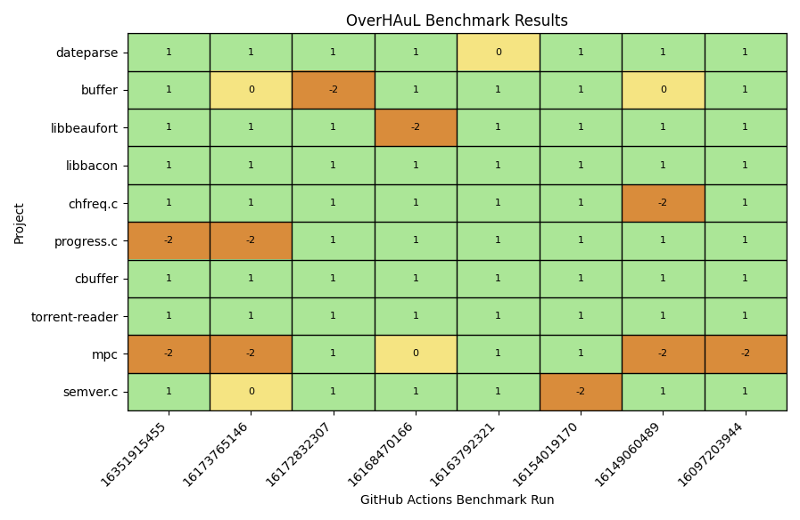

# Results

OverHAuL was evaluated through the experimental benchmark (@sec-benchmark) from 6th of June, 2025 to 18th of July, 2025, using OpenAI's gpt-4.1-mini model.^[<https://platform.openai.com/docs/models/gpt-4.1-mini>] For these runs, each OverHAuL execution was configured with a 5 minute harness execution timeout and an iteration budget of 10. Each benchmark run was executed as a GitHub Actions workflow, and the result directory (described in @sec-local) for each is available as a downloadable artifact in the corresponding GitHub Actions entry. In @fig-results, the results of these benchmark runs are showcased.

:::{#fig-results}

{fig-scap='OverHAuL's Benchmark Results'}

The benchmark results for OverHAuL are illustrated with the $y$-axis depicting the ten-project corpus outlined in @sec-benchmark. The $x$-axis represents the various benchmark runs. Each label constitutes a unique hash identifier corresponding to a specific GitHub Actions workflow run, which can be accessed at <https://github.com/kchousos/OverHAuL/actions/runs/HASH>. An overview of all benchmark runs is available at <https://github.com/kchousos/OverHAuL/actions/workflows/benchmarks.yml>. In this plot, a green block indicates that OverHAuL successfully generated a new harness for the project and was able to find a crash input. On the other hand, a yellow block indicates that while a compilable harness was produced, no crash input was found within the five-minute execution period. Importantly, there are no red blocks, which would indicate cases where a compilable harness could not be generated.
:::

We can deduce the following facts from @fig-results: Firstly, OverHAuL has a very high success rate in finding crash inputs for the given programs, specifically one of *92.5%*. Secondly, although according strictly to these results OverHAuL never generates an un-compilable harness, we can err on the side of caution and infer that OverHAuL not being able to generate a compilable harness is a rare occurrence. These conclusions can safely answer RQ1 with a resounding yes.

From sampling OverHAuL's generated harnesses, the answer to RQ2 remains unclear. Most of the time, the fuzz targets that are produced are understandable and similar to something a software engineer might program. Take for example @lst-sample-dateparse. Nonetheless, sometimes generated harnesses contain usage of inexplicable or arbitrary constants and peculiar control flow checks. This makes them harder to understand and quite possibly incorrect in many cases, thus diverging from seeming human-written. RQ2's answer remains an unclear "it depends", given the variance in OverHAuL's results.

::: {#lst-sample-dateparse fig-scap='Sample harness for dateparse'}
```C
#include <stddef.h>
#include <stdint.h>
#include <string.h>
#include <stdlib.h>
#include "dateparse.h"

// No artificial size limit to allow fuzzer to explore full input size for boundaries

int LLVMFuzzerTestOneInput(const uint8_t *data, size_t size) {
    // Allocate buffer with extra byte for null termination
    char *input_str = (char *)malloc(size + 1);
    if (!input_str) {
        return 0;
    }

    memcpy(input_str, data, size);
    input_str[size] = '\0';

    date_t parsed_date = 0;
    int offset = 0;

    // Array of string lengths targeting boundary conditions (including 0 = internal strlen)
    size_t test_lens[] = {0, size, size > 0 ? size - 1 : 0, 12, 13, 14};

    for (size_t i = 0; i < sizeof(test_lens) / sizeof(test_lens[0]); i++) {
        size_t len = test_lens[i];
        if (len <= size) {
            dateparse(input_str, &parsed_date, &offset, (int)len);
        }
    }

    free(input_str);
    return 0;
}
```

Sample harness for dateparse, generated by OverHAuL.
:::

When it comes to LLM usage, two dimensions can be explored. First, the LLM model used. Second, the prompting techniques implemented. When it comes to LLM models, all benchmark runs in GitHub's infrastructure were executed using OpenAI's gpt-4.1-mini. However, local tests were also conducted with gpt-4.1, gpt-4o, gpt-4 and gpt-3.5-turbo. gpt-4.1 and gpt-4.1-mini had comparable positive results, with gpt-4o following. However, gpt-4 and gpt-3.5-turbo models had considerably worse performance, averaging at about 2/10 successfully harnessed projects per benchmark run. This points to a considerable qqqqq


 RQ3

- Different prompting techniques were a lot more impactful
  - Zero-shot prompting had expectedly unremarkable results
  - Chain of Thought prompting showed little improvement
  - ReAct yielded the most results, mainly due to the more sophisticated code exploration accompanying it by definition

RQ4

- Simple source code concatenation has obvious drawbacks, mainly due to context window limitations
- Access to tools that return file contents is a step forward, but still suffers with small context windows
- A function-level vector store is the most scalable approach, both when scaling in file or project size
