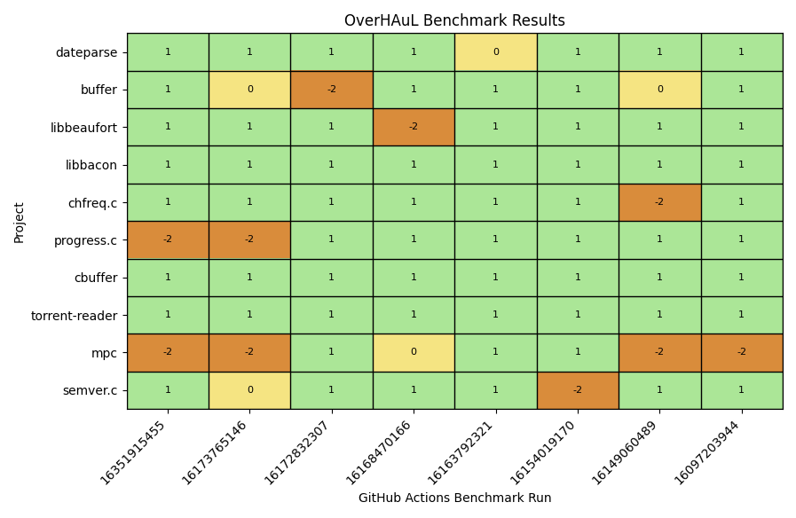
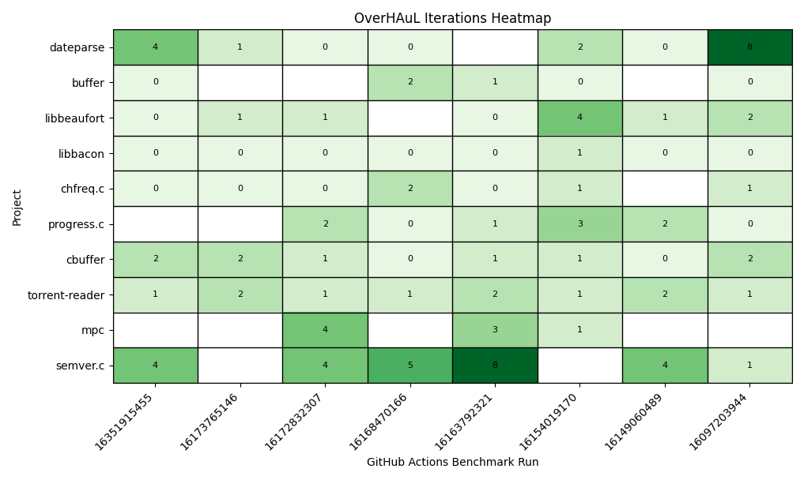

# Evaluation {#sec-eval}

To thoroughly assess the performance and effectiveness of OverHAuL, we established four *research questions* to direct our investigative efforts. These questions are designed to provide a structured framework for our inquiry and to ensure that our research remains focused on the key aspects of OverHAuL's functionality and impact within its intended domain. By addressing these questions, we aim to uncover valuable insights that will contribute to a deeper understanding of OverHAuL's capabilities and its position in contemporary automatic fuzzing applications:

- **RQ1**: Can OverHAuL generate working harnesses for unfuzzed C projects?

- **RQ2**: What characteristics do these harnesses have? Are they similar to man-made harnesses?

- **RQ3**: How do LLM usage patterns influence the generated harnesses?

- **RQ4**: How do different symbolic techniques affect the generated harnesses?

## Experimental Benchmark {#sec-benchmark}

To evaluate OverHAuL, a benchmarking script was implemented^[Available at <https://github.com/kchousos/OverHAuL/blob/master/benchmarks/benchmark.sh>.] and a corpus of ten open-source C libraries was assembled. This collection comprises firstly of user dhvar's "dateparse" library, which is also used as a running example in OSS-Fuzz-Gen's [@oss-fuzz-gen] experimental from-scratch harnessing feature (@sec-related). Secondly, nine other libraries chosen randomly^[From the subset of libraries that do not have exotic external dependencies, like the X11 development toolchain.] from the package catalog of Clib, a "package manager for the C programming language" [@clibs; @clib]. All libraries can be seen @tbl-projects, along with their descriptions. 

OverHAuL was evaluated through the experimental benchmark from 6th of June, 2025 to 18th of July, 2025, using OpenAI's gpt-4.1-mini model [@openaidocs2025]. For these runs, each OverHAuL execution was configured with a 5 minute harness execution timeout and an iteration budget of 10. Each benchmark run was executed as a GitHub Actions workflow on Linux virtual machines with 4-vCPUs and 16GiB of memory hosted on Microsoft Azure [@githubdocs2025a; @githubdocs2025]. The result directory (as described in @sec-local) for each is available as a downloadable artifact in the corresponding GitHub Actions entry. 

::: {#tbl-projects fig-scap='Benchmark corpus' tbl-colwidths="[25,60,7,8]"}

| Project                                                             | Description                                                                | Stars | SLOC |
|:--------------------------------------------------------------------|:---------------------------------------------------------------------------|------:|-----:|
| [dvhar/dateparse](https://github.com/dvhar/dateparse)               | A library that allows parsing dates without knowing the format in advance. |     2 | 2272 |
| [clibs/buffer](https://github.com/clibs/buffer)                     | A string manipulation library.                                             |   204 |  354 |
| [jwerle/libbeaufort](https://github.com/jwerle/libbeaufort)         | A library implementation of the Beaufort cipher [@franksen1993].           |    13 |  321 |
| [jwerle/libbacon](https://github.com/jwerle/libbacon)               | A library implementation of the Baconian cipher [@bacon1861].              |     8 |  191 |
| [jwerle/chfreq.c](https://github.com/jwerle/chfreq.c)               | A library for computing the character frequency in a string.               |     5 |   55 |
| [jwerle/progress.c](https://github.com/jwerle/progress.c)           | A library for displaying progress bars in the terminal.                    |    76 |  357 |
| [willemt/cbuffer](https://github.com/willemt/cbuffer)               | A circular buffer implementation.                                          |   261 |  170 |
| [willemt/torrent-reader](https://github.com/willemt/torrent-reader) | A torrent-file reader library.                                             |     6 |  294 |
| [orangeduck/mpc](https://github.com/orangeduck/mpc)                 | A type-generic parser combinator library.                                  | 2,753 | 3632 |
| [h2non/semver.c](https://github.com/h2non/semver.c)                 | A semantic version v2.0 parsing and rendering library [@semver].           |   190 |  608 |

The benchmark project corpus. Each project name links to its corresponding GitHub repository. Each is followed by a short description and its GitHub stars count, as of July 18th, 2025.
:::

### Local Benchmarking {#sec-local}

To run the benchmark locally, one would need to follow the installation instructions in @sec-install and then execute the benchmarking script, like so:

```text
$ ./benchmarks/benchmark.sh
```

The cloned repositories with their corresponding harnesses will then be located in a subdirectory of `benchmark_results`, which will have the name format of `mini__<timestamp>__ReAct__<llm-model>__<max-exec-time>__<iter-budget>`. "Mini" corresponds to the benchmark project corpus described above, since a 30-project corpus was initially created and is now coined as "full" benchmark. Both the mini and full benchmarks are located in `benchmarks/repos.txt` and `benchmarks/repos-mini.txt` respectively. To execute the benchmark for the "full" corpus, users can add the `-b full` flag in the script's invocation. Also, the LLM model used can be defined with the `-m` command-line flag.

## Results {#sec-results}

The outcomes of the benchmark experiments are shown in @fig-results. To ensure the reliability of these results, each reported crash was manually validated to confirm that it stemmed from genuine defects within the target library, rather than issues of the generated harness. An iteration heatmap was also generated for the verifiably fuzzed projects, displayed in @fig-iterations. With these validated findings, we are now positioned to address the initial research questions posed in this chapter.

:::{#fig-results}
{fig-scap='Benchmark Results'}

The benchmark results for OverHAuL are illustrated with the $y$-axis depicting the ten-project corpus outlined in @sec-benchmark. The $x$-axis represents the various benchmark runs. Each label constitutes a unique hash identifier corresponding to a specific GitHub Actions workflow run, which can be accessed at <https://github.com/kchousos/OverHAuL/actions/runs/HASH>. An overview of all benchmark runs is available at <https://github.com/kchousos/OverHAuL/actions/workflows/benchmarks.yml>. In this matrix, a green/1 block indicates that OverHAuL successfully generated a new harness for the project and was able to find a crash input. On the other hand, a yellow/0 block indicates that while a compilable harness was produced, no crash input was found within the five-minute execution period. Finally, an orange/-2 block means that the crash that was found derives from errors in the harness itself. AImportantly, there are no red/-1 blocks, which would indicate cases where a compilable harness could not be generated.
:::

::: {#fig-iterations}
{fig-scap='Iterations Heatmap'}

This heatmap illustrates the number of iterations required for each project to be successfully harnessed, as determined by the benchmark results. Higher color intensity corresponds to a greater number of iterations needed for successful harnessing. Cells left blank signify instances where no valid harness was generated.
:::

### RQ 1: Can OverHAuL generate working harnesses for unfuzzed C projects?

OverHAuL demonstrates a strong capability in generating working harnesses for previously unfuzzed C projects. In benchmark evaluations, it achieved a success rate of **81.25%** in producing fuzzing harnesses that were effective at uncovering crash-inducing inputs in target programs. Notably, all harnesses generated by OverHAuL were valid C programs---an improvement over prior methods such as OSS-Fuzz-Gen [@oss-fuzz-gen], which occasionally outputs the LLM's markdown answers instead. The harnesses consistently utilized existing functions obtained from the codebase oracle and interacted appropriately with the Library Under Test's API, with only minimal instances of irrelevant or hallucinated code observed. While the potential exists for non-compilable harnesses to be generated, the benchmark results included no such cases, underscoring the significance and effectiveness of compilation feedback and the integrated "fixer" agent in OverHAuL's workflow. These findings collectively indicate that OverHAuL is effective at generating robust, valid, and meaningful harnesses for C projects lacking previous fuzzing infrastructure.

### RQ2: What characteristics do these harnesses have? Are they similar to man-made harnesses?

In examining the characteristics of the generated harnesses, we observe several notable patterns. The harnesses are typically well-commented, a result of explicit instructions given to the language models. They are designed to target various levels of the library's functionality. In some cases, they focus on higher-level entry point functions (@sec-dateparse), while in other instances, they concentrate on more narrowly scoped internal functions (@lst-harness). Usually the generated fuzz targets are clear and closely resemble the kind of harnesses a skilled software engineer might write. These harnesses make appropriate and sensible use of the target API, as illustrated in examples such as @lst-harness. However, some harnesses do exhibit the use of unexplained constants or idiosyncratic control flow constructs, which can hinder comprehensibility and may introduce errors. Additionally, we find that the characteristics of generated harnesses can vary substantially across different projects and even between runs, with differences evident in both their size and complexity (see @sec-sample-harnesses). Overall, while the generated harnesses often echo the structure and intent of man-made harnesses, inconsistencies and occasional inexplicable design choices distinguish them from their manually written counterparts.

### RQ3: How do LLM usage patterns influence the generated harnesses?

The effectiveness of LLM-driven fuzzing harness generation in OverHAuL is heavily influenced by two primary factors: model selection and prompting strategies. The experimental evaluation presents compelling evidence regarding the substantial impact of both dimensions.

All benchmark experiments on GitHub's infrastructure were conducted using OpenAI's gpt-4.1-mini. Preliminary local testing included a spectrum of models---gpt-4.1, gpt-4o, gpt-4, and gpt-3.5-turbo. Notably, both gpt-4.1 and gpt-4.1-mini achieved comparable performance, consistently generating robust fuzzing harnesses. In contrast, gpt-4o yielded somewhat average results, while gpt-4 and gpt-3.5-turbo exhibited significantly inferior performance, averaging only 2 out of 10 projects successfully harnessed per benchmark run. Models with suboptimal performance were excluded in subsequent development phases. These findings underscore the necessity of selecting advanced LLM architectures to realize OverHAuL's potential; in particular, gpt-4o represents a recent baseline for acceptable performance. Because LLM model capabilities are evolving rapidly, it is reasonable to anticipate ongoing improvements in OverHAuL's harness-generation efficacy as newer LLMs become available.

Prompting methodology is equally crucial. The adoption of ReAct prompting has proven most effective in the current implementation of OverHAuL [@reAct]. Alternative prompting paradigms---including zero-shot and Chain-of-Thought (COT) approaches [@chainofthought]---were empirically evaluated, as detailed in @sec-abandoned, but failed to deliver satisfactory outcomes. A central challenge in automated harness generation involves ensuring that the resulting harness is both compilable and operationally effective. This alignment with real-world constraints necessitates continuous interaction between the LLM and the target environment, best achieved through agentic workflows [@giannone2025]. The superior performance of ReAct prompting likely stems from its structured approach to iterative code exploration and refinement, facilitating a cycle of observation, planning, and action that is particularly well-suited to harness synthesis.

A central element of OverHAuL's architecture is its triplet of ReAct agents, each contributing a distinct role in the collaborative generation of fuzzing harnesses. Local benchmarking demonstrates an almost linear increase in success rates with the number of iteration cycles, underscoring the efficacy of agentic collaboration and iterative refinement in enhancing harness quality. As illustrated in @fig-iterations, projects such as "dateparse" and "semver.c" exhibit marked improvements when afforded larger iteration budgets. This trend highlights the pivotal roles of the "fixer" and "improver" agents, whose interventions enable the system to surmount challenges present in initial harness generations, ultimately advancing the caliber of the final outputs.

Additionally, the inclusion of a codebase oracle is instrumental in scaling code exploration efficiently. Unlike previously tested methods (see @sec-abandoned), the codebase oracle enables comprehensive traversal and understanding of project code, overcoming the token and context window limitations typically associated with LLMs.

In summary, the findings for RQ3 indicate that continuous advancements in LLM technology and prompting architectures will further enhance the ability of systems like OverHAuL to automate efficient fuzzing harness generation. Integrating agentic modules that can dynamically assess their environment and incorporate runtime feedback will likely outperform more static LLM applications, particularly within the domain of automated fuzzing.

### RQ4: How do different symbolic techniques affect the generated harnesses?

Throughout the development of OverHAuL and its various iterations, numerous programming techniques were assessed in pursuit of answering RQ4 (@sec-abandoned). Simple source code concatenation and its subsequent injection into LLM prompts revealed significant limitations, primarily due to the constraints of context windows. Conversely, the usage of tools capable of retrieving file contents marked a meaningful advancement. Nonetheless, this approach still encountered challenges, such as inaccessible code blocks and exploration that lacked semantic relevance. In response to these difficulties, the implementation of a function-level vector store functioning as a codebase oracle is proposed as a highly scalable solution. This strategy not only enhances the organization of larger files but also accommodates expanding project sizes, facilitating more semantically meaningful code examination.

The significance of the iterative feedback loop is clearly demonstrated by the results presented in @fig-iterations. Analysis of the heatmap reveals that earlier versions of OverHAuL, which employed a one-shot approach to harness generation, achieved a success rate of only 28.75%. In contrast, the current implementation shows that 42 out of 65 projects successfully fuzzed (64.62%) did not produce a successful harness in the initial attempt and therefore benefited from the iterative feedback process. Notably, two projects (3.07%) required the full allocation of eight iterations, underscoring the necessity of maintaining a generous iteration budget to maximize effectiveness.


## Discussion

As discussed in Section @sec-results, the capabilities and effectiveness of OverHAuL are closely tied to the choice of the underlying large language model. OverHAuL's modular architecture ensures that advances in LLM research will directly enhance its performance. Each release of a new, more capable model can be readily integrated, thereby amplifying OverHAuL's effectiveness without the need for substantial redesign.

A noteworthy consideration in our benchmarking setup is the possibility that some of the open-source libraries evaluated may have been included in the LLM's training data. This introduces a risk of overestimating OverHAuL's performance on code that is unseen or proprietary. Results for closed-source or less widely available libraries could therefore be weaker. Nonetheless, this potential limitation can theoretically be addressed through targeted fine-tuning of the LLM [@openaidocs2025b; @kim2025].

### Threats to Validity

Our evaluation of OverHAuL was conducted on ten relatively obscure open-source C libraries representing a range of application domains and functionalities. While this selection reduces the likelihood that these projects were used in LLM training and thus minimizes potential bias, it remains uncertain how transferable our results are to larger, more complex, or structurally different codebases. Factors such as varying design paradigms, architectural patterns, or real-world deployment contexts may pose new challenges for OverHAuL's scalability and effectiveness. 

Additionally, the risk of LLM hallucination constitutes an internal threat to validity. Such hallucinations may require multiple attempts or occasional manual adjustments to produce valid and useful fuzz drivers. However, because LLMs---and thus OverHAuL---operate in a non-deterministic manner, it is possible to rerun the process and obtain alternative results. The inherent stochasticity of the underlying LLMs thus allows users to recover from initial failures, ensuring that the impact of hallucinations remains limited to efficiency rather than undermining the core applicability of the approach.

In summary, while our findings demonstrate the potential of OverHAuL, they also highlight important limitations and directions for future work, especially in improving robustness and evaluating performance across a broader spectrum of software projects.
