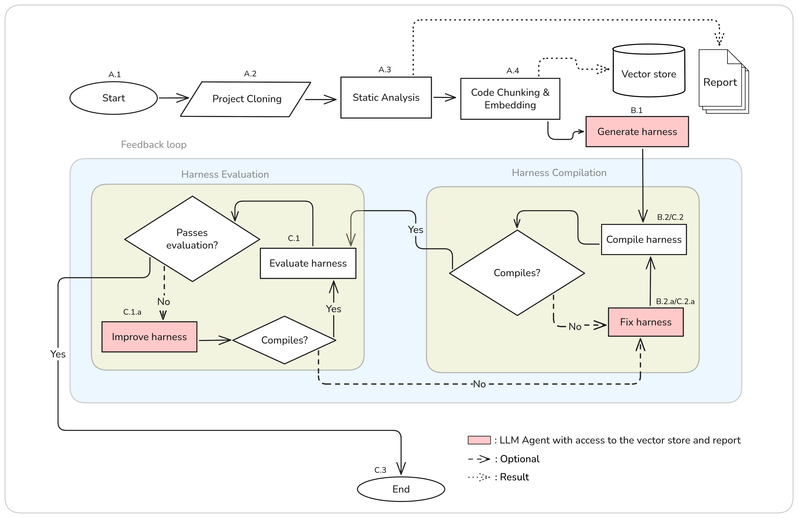

# OverHAuL's Design {#sec-overhaul}

In this thesis we present **OverHAuL** (**H**arness **Au**tomation with **L**LMs), a neurosymbolic AI tool that automatically generates fuzzing harnesses for C libraries through LLM agents. In its core, OverHAuL is comprised by a triplet of LLM ReAct agents [@reAct]---each with its own responsibility and scope---and a codebase oracle reserving the given project's analyzed source code. An overview of OverHAuL's process is presented in @fig-flowchart, detailed in @sec-architecture. The objective of OverHAuL is to streamline the process of fuzz testing for unfuzzed C libraries. Given a link to a git repository [@torvalds2005] of a C library, OverHAuL automatically generates a new fuzzing harness specifically designed for the project. In addition to the harness, it produces a compilation script to facilitate building the harness, generates a representative input that can trigger crashes, and logs the output from the executed harness.

:::{#fig-flowchart}
{fig-scap='OverHAuL Workflow'}

Overview of OverHAuL's automatic harnessing process.
:::

OverHAuL utilizes autonomous ReAct agents which inspect and analyze the project's source code. The latter is stored and interacted with as a set of text embeddings [@mikolov2013], kept in a vector store. Both approaches are, to the best of our knowledge, novel in the field of automatic fuzzing harnesses generation. OverHAuL also implements an evaluation component that assesses in real-time all generated harnesses, making the results tenable, reproducible and well-founded. Ideally, this methodology provides a comprehensive and systematic framework for identifying previously unknown software vulnerabilities in projects that have not yet been fuzz tested.

As detailed in @sec-differences, OverHAuL does not expect and depend on the existence of client code or unit tests [@utopia; @fudge; @fuzzgen] *nor* does it require any preexisting fuzzing harnesses [@oss-fuzz-gen] or any documentation present [@sun2024]. Also importantly, OverHAuL is decoupled from other fuzzing projects, thus lowering the barrier to entry for new projects [@oss-fuzz-gen; @oss-fuzz]. Lastly, the user isn't mandated to manually specify the function which the harness-to-be-generated must fuzz. Instead, OverHAuL's agents examine and assess the provided codebase, choosing after evaluation the most optimal target function.

Finally, OverHAuL excels in its user-friendliness, as it constitutes a simple and easily-installable Python package with minimal external dependencies---only real dependency being Clang, a prevalent compiler available across all primary operating systems. This contrasts most other comparable systems, which are typically characterized by their limited documentation, lack of extensive testing, and a focus primarily on experimental functionality.^[For instance, both fuzz-introspector and OSS-Fuzz-Gen are integrated by design to the OSS-Fuzz platform [@fuzz-introspector; @oss-fuzz-gen; @oss-fuzz]. When utilized outside this environment, they require users to operate directly from the project's root directory and interact with the tools primarily through unrefined Python scripts, thereby limiting their accessibility and ease of use.]

## Installation and Usage {#sec-install}

The source code of OverHAuL is available in <https://github.com/kchousos/OverHAuL>. OverHAuL can be installed by cloning the git repository locally, creating and enabling a Python3.10 virtual environment [@venv] (optional, but recommended) and installing it inside the environment using Python's PIP package installer [@pip], like in @lst-install.

::: {#lst-install fig-scap='OverHAuL installation'}
``` text
$ git clone https://github.com/kchousos/overhaul; cd overhaul
  ...
$ python3.10 -m venv .venv
$ source ./.venv/bin/activate
$ pip install .
  ...
$ overhaul --help
usage: overhaul [-h] [-c COMMIT] [-m MODEL] [-f FILES [FILES ...]] 
[-o OUTPUT_DIR] repo

Generate fuzzing harnesses for C/C++ projects

positional arguments:
  repo                  Link of a project's git repo, for which to generate 
                        a harness.

options:
  -h, --help            show this help message and exit
  -c COMMIT, --commit COMMIT
                        A specific commit of the project to check out
  -m MODEL, --model MODEL
                        LLM model to be used. Available: o3-mini, o3, gpt-4o,
                        gpt-4o-mini, gpt-4.1, gpt-4.1-mini, gpt-3.5-turbo, gpt-4
  -f FILES [FILES ...], --files FILES [FILES ...]
                        File patterns to include in analysis (e.g. *.c *.h)
  -o OUTPUT_DIR, --output-dir OUTPUT_DIR
                        Directory to clone the project into. Defaults to "output"
$
```

OverHAuL's straightforward installation process.
:::

To use OverHAuL, you need to provide a secret key for using OpenAI's API service. This key can be either stored in a `.env` file in the root directory or exported in the shell environment:

``` text
$ echo "OPENAI_API_KEY=<API-key-here>" >> .env
# OR
$ export OPENAI_API_KEY=<API-key-here>
```

Once these preliminary steps are completed, OverHAuL can be executed. The primary argument required by OverHAuL is the repository link of the library that is to be fuzzed. Additionally, users have the option to specify certain command-line flags, which allow them to control the checked-out commit of the cloned project, select the OpenAI LLM model from a predefined list, define specific file patterns for OverHAuL to search for, and determine the directory in which the project will be cloned. For a concrete example, we will use OverHAuL to create a new fuzzing harness for [dvhar's dateparsing C library](https://github.com/dvhar/dateparse) and specify the LLM model to OpenAI's gpt-4.1 model. The resulting command and its output is presented in @fig-success.

::: {#fig-success}
{fig-scap='OverHAuL execution on dateparse'}

A successful execution of OverHAuL, harnessing the "dateparse " library using OpenAI's gpt-4.1 model. Debug statements are printed to showcase the queries of the LLM agents to the codebase oracle (@sec-oracle).
:::

In this example, the dateparse repository is cloned into the `./output/dateparse` directory, which is relative to the root directory of OverHAuL. Following a successful execution, the project's directory will contain a new folder named `harnesses`, which will house all the generated harnesses formatted as `harness_n.c`---where $n$ ranges from 1 to $N-1$, with $N$ representing the total number of harnesses produced. The most recent and verifiably correct harness will be designated simply as `harness.c`. Additionally, the dateparse folder will include an executable script named `overhaul.sh`, which contains the compilation command necessary for the harness. A log file titled `harness.out` will also be present, documenting the output from the latest harness execution. Lastly and most importantly, there will be at least one non-empty crash file included, serving as a witness to the harness's correctness. In the following sections, the intermediary steps between invocation and completion are disected and analyzed. The dateparse project is used as a running example.

## Architecture {#sec-architecture}

OverHAuL can be compartmentalized in three stages: First, the project analysis stage (@sec-analysis), the harness creation stage (@sec-creation) and the harness evaluation stage (@sec-evaluation).

### Project Analysis {#sec-analysis}

In the project analysis stage (steps A.1--A.4), dateparse is ran through a static analysis tool named Flawfinder [@flawfinder] and is sliced into function-level chunks, which are stored in a vector store. The results of this stage are a *static analysis report* and a *codebase oracle*, i.e. a vector store containing embeddings of function-level code chunks. Both resources are later available to the LLM agents. Flawfinder is executed with the dateparse directory as input and is responsible for the static analysis report. This report is considered a meaningful resource, since it provides the LLM agent responsible with the harness creation with some starting points to explore, regarding the occurrences of potentially vulnerable functions and/or unsafe code practices. Part of dateparse's static analysis report is shown in @lst-static.

The codebase oracle is created in the following manner: The source code is first chunked in function-level pieces by traversing the code's Abstract Syntax Tree (AST) through Clang. Each chunk is represented by an object with the function's signature, the corresponding filepath and the function's body (see @lst-chunks). Afterwards, each function body is turned into a vector embedding through an embedding model. Each embedding is stored in the vector store. This structure is created and used for easier and more semantically meaningful code retrieval, and to also combat context window limitations present in LLMs.

### Harness Creation {#sec-creation}

Second is the harness creation stage (steps B.1--B.2). In this part, a "generator" ReAct LLM agent is tasked with creating a fuzzing harness for the project. The agent has access to a querying tool that acts as an interface between it and the codebase oracle. When the agent makes queries like "functions containing `strcpy()`", the querying tool turns the question into an embedding and through similarity search returns the top $k=5$ most similar results---in this case, functions of the project. With this approach, the agent is able to explore the codebase semantically and pinpoint potentially vulnerable usage patterns easily.

The harness generated by the agent is then compiled using Clang and linked with the AddressSanitizer, LeakSanitizer, and UndefinedBehaviorSanitizer. The compilation command used is generated programmatically, according to the rules described in @sec-scope. If the compilation fails for any reason, e.g. a missing header include, then the generated faulty harness and its compilation output are passed to a new "fixer" agent tasked with repairing any errors in the harness (step B.2.a). This results in a newly generated harness, presumably free from the previously shown flaws. This process is iterated until a compilable harness has been obtained. After success, a script is also exported in the project directory, containing the generated compilation command. Dateparse's compilation command is shown in @lst-compilation.

### Harness Evaluation {#sec-evaluation}

Third comes the evaluation stage (steps C.1--C.3). During this step, the compiled harness is executed and its results evaluated. Namely, a generated harness passes the evaluation phase if and only if:

1. The harness has no memory leaks during its execution

   This is inferred by the existence of `leak-<hash>` files.
   
2. A new testcase was created *or* the harness executed for at least `MIN_EXECUTION_TIME` (i.e. did not crash on its own)
   
   When a crash happens, and thus a testcase is created, it results in a `crash-<hash>` file.
   
3. The created testcase is not empty

   This is examined through `xxd`'s output given the crash-file.

Similarly to the second stage's compilation phase (steps B.2--B.2.a), if a harness does not pass the evaluation for whatever reason it is sent to an "improver" agent. This agent is instructed to refine it based on its code and cause of failing the evaluation. This process is also iterative. If any of the improved harness versions fail to compile, the aforementioned "fixer" agent is utilized again (steps C.2--C.2.a). All produced crash files and the harness execution output are saved in the project's directory. An evaluation-passing harness generated for the dateparse project is presented in @lst-harness, along with the associated crash input and execution output displayed in @lst-input and @lst-output, respectively.

## OverHAuL Techniques {#sec-techniques}

The fundamental techniques that distinguish OverHAuL in its approach and enhance its effectiveness in achieving its objectives are: The implementation of an iterative feedback loop between the LLM agents, the distribution of responsibility across a triplet of distinct agents and the employment of a "codebase oracle" for interacting with the given project's source code.

### Feedback Loop {#sec-loop}

The initial generated harness produced by OverHAuL is unlikely to be successful from the get-go. The iterative feedback loop implemented facilitates its enhancement, enabling the harness to be tested under real-world conditions and subsequently refined based on the results of these tests. This approach mirrors the typical workflow employed by developers in the process of creating and optimizing fuzz targets.

In this iterative framework, the development process continues until either an acceptable and functional harness is realized or the defined *iteration budget* is exhausted. The iteration budget $N=10$ is initialized at the onset of OverHAuL's execution and is shared between both the compilation and evaluation phases of the harness development process. This means that the iteration budget is decremented each time a dashed arrow in the flowchart illustrated in @fig-flowchart is followed. Such an approach allows for targeted improvements while maintaining oversight of resource allocation throughout the harness development cycle.

### React Agents Triplet

An integral design decision in our framework is the implementation of each agent as a distinct LLM instance, although all utilizing the same underlying model. This approach yields several advantages, particularly in the context of maintaining separate and independent contexts for each agent throughout each OverHAuL run.

By assigning individual contexts to the agents, we enable a broader exploration of possibilities during each run. For instance, the "improver" agent can investigate alternative pathways or strategies that the "generator" agent may have potentially overlooked or internally deemed inadequate inaccurately. This separation not only fosters a more diverse range of solutions but also enhances the overall robustness of the system by allowing for iterative refinement based on each agent's unique insights.

Furthermore, this design choice effectively addresses the limitations imposed by context window sizes. By distributing the "cognitive" load across multiple agents, we can manage and mitigate the risks associated with exceeding these constraints. As a result, this architecture promotes efficient utilization of available resources while maximizing the potential for innovative outcomes in multi-agent interactions. This layered approach ultimately contributes to a more dynamic and exploratory research environment, facilitating a comprehensive examination of the problem space.

### Codebase Oracle {#sec-oracle}

The third central technique employed is the creation and utilization of a codebase oracle, which is effectively realized through a vector store. This oracle is designed to contain the various functions within the project, enabling it to return the most semantically similar functions upon querying it. Such an approach serves to address the inherent challenges associated with code exploration difficulties faced by LLM agents, particularly in relation to their limited context window.

By structuring the codebase into chunks at the level of individual functions, LLM agents can engage with the code more effectively by focusing on its functional components. This methodology not only allows for a more nuanced understanding of the codebase but also ensures that the responses generated do not consume an excessive portion of the limited context window available to the agents. In contrast, if the codebase were organized and queried at the file level, the chunks of information would inevitably become larger, leading to an increase in noise and a dilution of meaningful content in each chunk [@zhao2024]. Given the constant size of the embeddings used in processing, each progressively larger chunk would be less semantically significant, ultimately compromising the quality of the retrieval process.

Defining the function as the primary unit of analysis represents the most proportionate balance between the size of the code segments and their semantic significance. It serves as the ideal "zoom-in" level for the exploration of code, allowing for greater clarity and precision in understanding the functionality of individual code segments. This same principle is widely recognized in the training of code-specific LLMs, where a function-level approach has been shown to enhance performance and comprehension [@chen2021]. By adopting this methodology, we aim to foster a more robust interaction between LLM agents and the underlying codebase, ultimately facilitating a more effective and efficient exploration process.

## High-Level Algorithm

A pseudocode version of OverHAuL’s main function is shown in @alg-main, illustrating the workflow depicted in @fig-flowchart and incorporating the methods explained in Sections -@sec-architecture and -@sec-techniques. Notably, within this algorithm, the `HarnessAgents()` function acts as an interface that connects the "generator", "fixer", and "improver" LLM agents. The specific agent utilized during each invocation of `HarnessAgents()` depends on the function's arguments. As a result, the $harness$ variable encapsulates all generated, fixed, or improved harnesses. Since both the "fixer" and "generator" agents are accessed through the `HarnessAgents()` function, the related `continue` statements correspond to the next iterations of fixing or improving a harness. This design choice streamlines the overall algorithm, making it more abstract and easier to comprehend.

```pseudocode
#| label: alg-main
\begin{algorithm}
\caption{OverHAuL}
\begin{algorithmic}[1]
\Require $repository$
\Ensure $harness, compilation\_script, crash\_input, execution\_log$
  \State $path \gets$ \Call{RepoClone}{$repository$}
  \State $report \gets$ \Call{StaticAnalysis}{$path$}
  \State $vector\_store \gets$ \Call{CreateOracle}{$path$}
  \State $acceptable \gets$ False
  \State $compiled \gets$ False
  \State $error \gets$ None
  \State $violation \gets$ None
  \State $output \gets$ None
  \For{$i = 1$ to $MAX\_ITERATIONS$}
    \State $harness \gets$ \Call{HarnessAgents}{$path, report, vector\_store, error, violation, output$}
    \State $error, compiled \gets$ \Call{BuildHarness}{$path, harness$}
    \If{$\neg compiled$}
      \State \textbf{continue} \Comment{Fix harness}
    \EndIf
    \State $output, accepted \gets $\Call{EvaluateHarness}{$path, harness$}
    \If{$\neg accepted$}
      \State \textbf{continue} \Comment{Improve harness}
    \Else
      \State $acceptable \gets$ True
      \State \textbf{break}
    \EndIf
  \EndFor
  \State \Return $compiled \land acceptable$
\end{algorithmic}
\end{algorithm}
```

## Scope {#sec-scope}

Currently, OverHAuL is designed to generate new harnesses specifically for medium-sized C libraries. Given the inherent complexity of dealing with C++ projects, this is not a feature yet supported within the system.

The compilation command utilized by OverHAuL is created programmatically. It incorporates the root directory along with all subdirectories that conform to a predefined set of common naming conventions. Additionally, the compilation process uses all C source files identified within these directories. Crucially, it is important that no `main()` function is present in any of the files to ensure successful compilation. For this reason any files or directories that include "test", "main", "example", "demo", or "benchmark" in their paths are systematically excluded from the compilation process. This exclusion also decreases the "noise" in the oracle, as these files do not constitute part of the core library and would therefore not contain any functions meaningful to the LLM agents.

Lastly, No support for build systems such as Make or CMake [@cedilnik2000; @feldman1979] is yet implemented. Such functionality would exponentially increase the complexity of the build step and is beyond the scope of this thesis.

## Implementation {#sec-implementation}

In creating the codebase oracle, we employ the "libclang" Python package [@he2025] to slice functions based on the AST capability provided by Clang. As detailed in @sec-oracle, the intermediate output consists of a list of Python dictionaries, with each dictionary storing a function’s body, signature, and corresponding file path. Each chunk of function code is then converted into an embedding using OpenAI's "text-embedding-3-small" model [@openaidocs2025a] and stored in a FAISS vector store index [@faiss]. This index is mapped to a metadata structure that contains the aforementioned function data—specifically the actual function body, signature, and file path. When a search is conducted on the index, the results returned are the embeddings. The responses that the LLM agent receives are derived from the corresponding metadata entries of each embedding.

All LLM agents and components are developed using the DSPy library, a declarative Python framework for LLM programming created by Stanford’s NLP research team [@dspy]. DSPy offers built-in modules and abstractions that facilitate the composition of LLMs and prompting techniques, such as Chain of Thought and ReAct (@lst-dspy). Each agent within OverHAuL is an instance of DSPy's ReAct module [@stanfordnlpteam2025], accompanied by a custom Signature [@stanfordnlpteam2025a]---displayed in @sec-signatures. DSPy was selected over other contemporary LLM libraries, such as LangChain and Llamaindex [@langchain; @llamaindex], because of its user-friendliness, logical abstractions, and efficient development process---qualities that are often lacking in these alternative libraries [@both2024; @woolf2023; @woyera2023].

::: {#lst-dspy fig-scap='DSPy example'}
```python
import dspy
lm = dspy.LM('openai/gpt-4o-mini', api_key='YOUR_OPENAI_API_KEY')
dspy.configure(lm=lm)

math = dspy.ChainOfThought("question -> answer: float")
math(question=(
    "Two dice are tossed. What is the probability that the sum equals two?"
))
```

Sample DSPy program.
:::

Repository cloning is executed using the `--depth 1` flag to minimize disk storage usage and reduce the size of artifacts.

The current implementation of OverHAuL sits at 1,254 source lines of Python code.

### Development Tools

The development of OverHAuL incorporates a variety of tools aimed at enhancing functionality and efficiency. Notably, "uv" is a Python package and project manager written in Rust that serves as a replacement for Poetry. Additionally, "Ruff," a code linter and formatter also developed in Rust, contributes to code quality by enforcing consistent formatting standards. The project also employs "MyPy," the widely-used static type checker for Python, to ensure type correctness. Testing is facilitated through "PyTest," a robust  Python testing framework. Lastly, "pdoc" is utilized as a Static Site Generator (SSG) to automate the creation of API documentation^[Available at <https://kchousos.github.io/OverHAuL/>.] [@astral2025; @astral2025a; @cortesi2025; @pytestdevteam2025; @pythonsoftwarefoundation2025].

### Reproducibility

OverHAuL's source code is available at <https://github.com/kchousos/OverHAuL>. Each benchmark run was conducted within the framework of a GitHub Actions workflow, resulting in a detailed summary accompanied by an artifact containing all cloned repositories. These artifacts are the compressed result directories described in @sec-local and provide the essential components necessary for the reproducibility each project's results, as described in @sec-install. All benchmark runs can be conveniently accessed at <https://github.com/kchousos/OverHAuL/actions/workflows/benchmarks.yml>.
